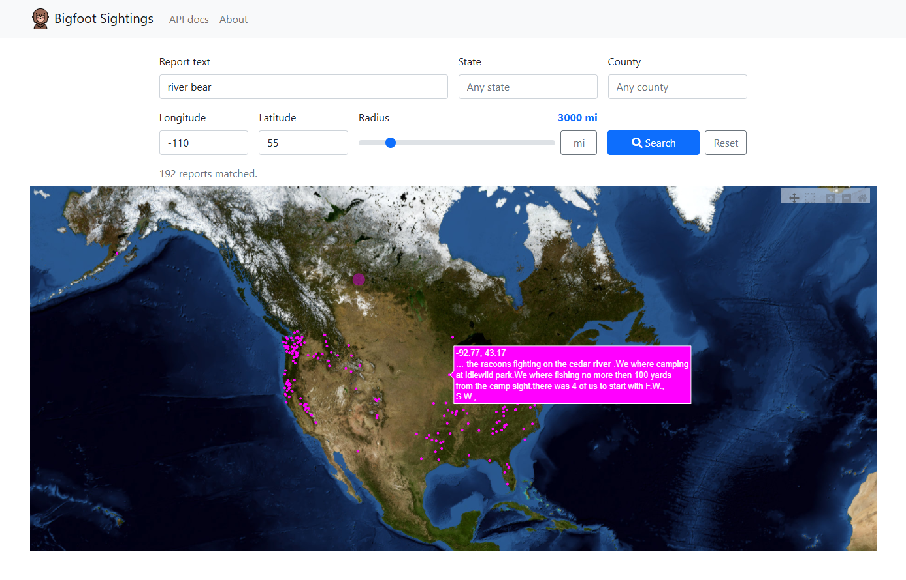

# Bigfoot Sightings

Full text, tag and geospatial search over ~5,000 BFRO Bigfoot sighting reports, built on the Redis
query engine and RedisJSON.

A single search combines four kinds of matching in one query — free text across report titles and
narratives, exact tag filters on state and county, a radius around a point, and two server side
aggregations for the charts — and Redis answers all of it.

<p align="center">
  
  <br>
  <sub>Every reported sighting matching the query, with counts grouped by season and by year.</sub>
</p>

## Contents

- [Quick start](#quick-start)
- [Architecture](#architecture)
- [API](#api)
- [Configuration](#configuration)
- [Development](#development)
- [Testing](#testing)
- [Design notes](#design-notes)
- [Data and credits](#data-and-credits)

## Quick start

### With Docker Compose

Requires Docker with Compose v2.

```bash
cp .env.example .env      # optional, every value has a default
docker compose up --build
```

Then open <http://localhost:8080>. The API documentation is at
<http://localhost:8080/api/docs>.

The stack is three services: `redis`, a one-shot `data-loader` that imports the CSV and exits, and
`app`, which waits for the import to complete successfully before it starts. Restarting `app` does
not re-import the data.

### Without Docker

Requires Node.js 20+ and a Redis 8 instance (or Redis Stack — anything providing the query engine
and JSON; a plain Redis build will not work).

```bash
npm ci
cp .env.example .env      # point REDIS_HOST at your instance
npm run data:load         # build the index and import the CSV
npm start
```

## Architecture

```
                     HTTP
                       |
    +------------------v------------------+
    |  api/      routers, Zod validation, |   request shape and error format
    |            RFC 9457 error handler   |
    +------------------+------------------+
                       |
    +------------------v------------------+
    |  service/  orchestration, caching   |   what a search means
    +------------------+------------------+
                       |
    +------------------v------------------+
    |  repository/  keys, index, commands |   how Redis is spoken to
    +------------------+------------------+
                       |
    +------------------v------------------+
    |  search/   query building, reply    |   pure functions, no I/O
    |            parsing, highlighting    |
    +-------------------------------------+
```

Each layer only knows about the one below it. The interesting logic — escaping untrusted input into
a query, and parsing RediSearch's positional replies — lives in `src/search/` as pure functions, so
it is tested exhaustively without a Redis server. Everything that does I/O takes its dependencies
through its constructor, which is what lets the integration suite run the entire HTTP stack against
a throwaway container.

```
src/
├── api/          routers, request schemas, error handling
├── config/       environment parsing and validation
├── domain/       the Sighting model and CSV mapping
├── lib/          logger and error types
├── redis/        client factory
├── repository/   all Redis access
├── search/       query builder, reply parser, highlighting (pure)
├── service/      search orchestration and facet caching
├── app.js        Express wiring
└── server.js     process lifecycle and graceful shutdown
```

### How a search is answered

1. `GET /api/sightings?text=river+bear&state=Washington` is validated by a Zod schema. Blank
   parameters are treated as absent, so the HTML form and the API share one schema.
2. `buildSearchQuery` compiles the criteria into `(river bear) @state:{Washington}`. User input is
   reduced to alphanumeric terms and tag values are backslash escaped, so nothing a client sends can
   change the structure of the query.
3. The service issues `FT.SEARCH` and two `FT.AGGREGATE` calls concurrently against the same query.
4. Replies are parsed by field name, matched terms become structured highlight segments, and the
   result is returned as JSON.

## API

Interactive documentation is served at `/api/docs`, generated from
[`docs/openapi.yaml`](docs/openapi.yaml).

| Method | Path                 | Description                                        |
| ------ | -------------------- | -------------------------------------------------- |
| `GET`  | `/api/sightings`     | Search by text, state, county and radius           |
| `GET`  | `/api/sightings/:id` | One full report                                    |
| `GET`  | `/api/facets`        | Distinct states and counties, for autocomplete     |
| `GET`  | `/health/live`       | Liveness: the process is running                   |
| `GET`  | `/health/ready`      | Readiness: Redis is reachable and the index exists |

```bash
curl "http://localhost:8080/api/sightings?text=river%20bear&state=Washington&limit=2"
```

```json
{
  "query": "(river bear) @state:{Washington}",
  "total": 14,
  "limit": 2,
  "offset": 0,
  "sightings": [
    {
      "id": 3,
      "title": "Campers report a bear like shape by the river",
      "titleHighlights": [
        { "text": "Campers report a ", "match": false },
        { "text": "bear", "match": true },
        { "text": " like shape by the ", "match": false },
        { "text": "river", "match": true }
      ],
      "location": { "longitude": -122.1, "latitude": 46.9 }
    }
  ],
  "statistics": {
    "byYear": [{ "year": 1998, "count": 1 }],
    "bySeason": [{ "season": "Spring", "count": 1 }]
  }
}
```

Errors are [RFC 9457](https://www.rfc-editor.org/rfc/rfc9457/) problem details:

```json
{
  "type": "about:blank",
  "title": "validation_failed",
  "status": 400,
  "detail": "invalid request query",
  "errors": [{ "field": "lon", "message": "Too big: expected number to be <=180" }]
}
```

## Configuration

Every variable is optional and validated at startup; an invalid value fails the boot with a message
naming the variable rather than surfacing later as a confusing runtime error. See
[`.env.example`](.env.example).

| Variable                     | Default                          | Description                       |
| ---------------------------- | -------------------------------- | --------------------------------- |
| `SERVER_PORT`                | `8080`                           | Port to listen on                 |
| `SERVER_HOST`                | `http://127.0.0.1`               | Base URL used for links           |
| `SERVER_SHUTDOWN_TIMEOUT_MS` | `10000`                          | Grace period before a forced exit |
| `LOG_LEVEL`                  | `info`                           | `fatal`…`trace`, or `silent`      |
| `REDIS_HOST`                 | `127.0.0.1`                      | Redis host                        |
| `REDIS_PORT`                 | `6379`                           | Redis port                        |
| `REDIS_USERNAME`             | `default`                        | Redis ACL user                    |
| `REDIS_PASSWORD`             | _(empty)_                        | Redis password                    |
| `REDIS_DB`                   | `0`                              | Redis database index              |
| `SEARCH_INDEX_NAME`          | `sightings-index`                | Name of the search index          |
| `SEARCH_MAX_LIMIT`           | `10000`                          | Largest page a client may request |
| `SEARCH_DEFAULT_LIMIT`       | `5000`                           | Page size when none is given      |
| `FACETS_CACHE_TTL_MS`        | `300000`                         | Facet cache lifetime              |
| `DATA_FILE`                  | `data/bfro_reports_geocoded.csv` | Source CSV                        |
| `DATA_LOAD_BATCH_SIZE`       | `500`                            | Documents per pipeline batch      |

## Development

```bash
npm run dev            # start with automatic restart on change
npm run data:load      # create the index and import the CSV
npm run data:clear     # drop the index and delete every document
npm run data:reload    # clear, then load
npm run lint           # ESLint
npm run format         # Prettier
```

## Testing

```bash
npm test               # unit tests, no external services needed
npm run test:integration   # integration tests, requires Docker
npm run test:all
npm run test:coverage
```

Unit tests cover query building, escaping, reply parsing, highlighting, CSV mapping, the service
layer against a stubbed repository, and the HTTP surface via Supertest.

The integration suite starts a real Redis 8 container with
[Testcontainers](https://testcontainers.com/), seeds fixtures, and drives the full stack over HTTP.
It exists to check the assumptions a mock would simply encode: that the query strings this codebase
generates are accepted by the query engine, and that the reply shapes it parses are the ones Redis
actually returns.

CI runs lint, format check and unit tests on Node 20 and 22, the integration suite, and a Docker
build that boots the full compose stack and probes it.

## Design notes

A few decisions that are easy to miss when reading the code.

**Untrusted input never reaches the query as syntax.** Free text is reduced to alphanumeric terms
and tag values are backslash escaped, so a search for `Ohio} | @county:{Athens` matches nothing
rather than rewriting the query. `escapeTagValue` and `buildSearchQuery` are pure functions with
dedicated tests for exactly this.

**Text that cannot be honoured narrows the search, it does not widen it.** Input such as `*` or
`"|-+~` leaves no usable terms behind. Dropping the clause would turn the search into a match-all,
so `buildSearchQuery` returns `null` and the service answers with an empty result instead of asking
Redis three questions whose answer is already known. Reducing a filter to nothing is never allowed to
return more than the filter would have.

**Highlighting returns data, not markup.** The API answers with `{ text, match }` segments rather
than `<b>` tags, and the client renders each segment as a text node, so report text drawn from a
public data set cannot introduce markup into the page. The segments are produced by matching the
search terms in application code: the query engine rejects `HIGHLIGHT` and `SUMMARIZE` outright on a
JSON index, so it cannot mark them for us. Concatenating the segments always reproduces the original
field exactly, which is what lets the client rebuild the text it did not highlight.

**Liveness and readiness answer different questions.** The server starts even when Redis is
unreachable and keeps retrying in the background; `/health/ready` reports whether searches can
actually be served. During a rolling restart that difference is what stops an orchestrator killing a
healthy process.

**Aggregation buckets are filtered, not trimmed.** Undated reports are stored with a `null` date and
land in a year-zero bucket. That bucket is dropped by checking the year, rather than by discarding
the first row of the reply and hoping it is always the right one.

**The import streams in batches.** Rows are validated individually, mapped to a fresh object each
time, and written in pipelined batches, so a malformed row is counted and skipped instead of taking
the import down with it.

## Data and credits

Sighting data comes from the [BFRO](https://www.bfro.net/), via Timothy Renner's
[geocoded data set](https://data.world/timothyrenner/bfro-sightings-data/). The geocoded version is
used because the application offers geospatial search.

Built with [Express](https://expressjs.com/), [ioredis](https://github.com/redis/ioredis/),
[Zod](https://zod.dev/), [Plotly.js](https://plotly.com/javascript/) and
[Bootstrap](https://getbootstrap.com/).

Icons from [Flaticon](https://www.flaticon.com/premium-icon/bigfoot_1126838/).

## License

MIT — see [LICENSE](LICENSE).

Author: Aleksandar Miladinović ([@squirrelosopher](https://github.com/squirrelosopher/))
