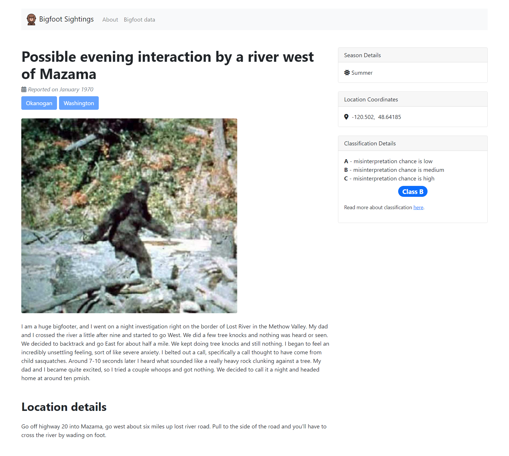

# Using RediSearch and RedisJSON to provide powerful search over Bigfoot sightings.
Explore Bigfoot sightings within the demonstrative **NodeJS** application. Find relative data with the ability to search for sightings reported at specific state and/or county, containing specific word(s) and/or withing specific distance radius from the base point.

Home page contains the following **3** plots.
- map showing reported Bigfoot sightings based on a query, with short hover information
- plot showing Bigfoot sightings based on a query, grouped by season
- plot showing Bigfoot sightings based on a query, grouped by year

<p align="center">
  
</p>

On hover, each Bigfoot sighting shows short summarized description with **highlighted** queried data.

<p align="center">
  
</p>

On click, you're able to get complete details regarding specific Bigfoot sighting.

<p align="center">
  
</p>

# Running with Docker Compose

```bash
$ docker --version
Docker version 20.10.12, build e91ed57
```

Copy/rename environment variables.

```bash
$ cp .env.example .env
```

Set appropriate environment variables or use already predefined variables. See [section](#environment) for more details about each environment variable.

Once you have **.env** file copied/modified, build and start application with following *Docker Compose* commands.

```bash
$ docker-compose build
$ docker-compose up
...
Friday, 01 Apr 2022 19:51:55 GMT INFO server listening on port 80
...
```
You can now explore reported Bigfoot sightings locally (**localhost**);

# Pages

## /
Page showing the overview of the Bigfoot sightings, with the ability to query for specific sighting(s).

## /sighting
Page showing complete details for the specific Bigfoot sighting, including county, state, location coordinates, location details, date of the actual report, season and classification details, as well as title and description.

# Environment
| Variable          | Description |
| -----------       | ----------- |
| SERVER_HOST       | host on which application will be running |
| SERVER_PORT       | port on which application will be running |
| DEBUG             | defines debug logging |
| REDIS_HOST        | host on which *Redis* server is running |
| REDIS_PORT        | port on which *Redis* server is running |
| REDIS_USER        | user used to connect to *Redis* server |
| REDIS_PASSWORD    | password used to connect to *Redis* server |
| REDIS_DB_ALIAS    | database alias to connect to |


# Data
Application is using Bigfoot sightings data, which contains sighing data publicly available on the [*BFRO*](https://www.bfro.net/) website in a more digestible form.

The **geocoded** version has been used since the application itself offers geospatial search as well. Bigfoot sightings data can be found and downloaded [here](https://data.world/timothyrenner/bfro-sightings-data/workspace/file?filename=bfro_reports_geocoded.csv).